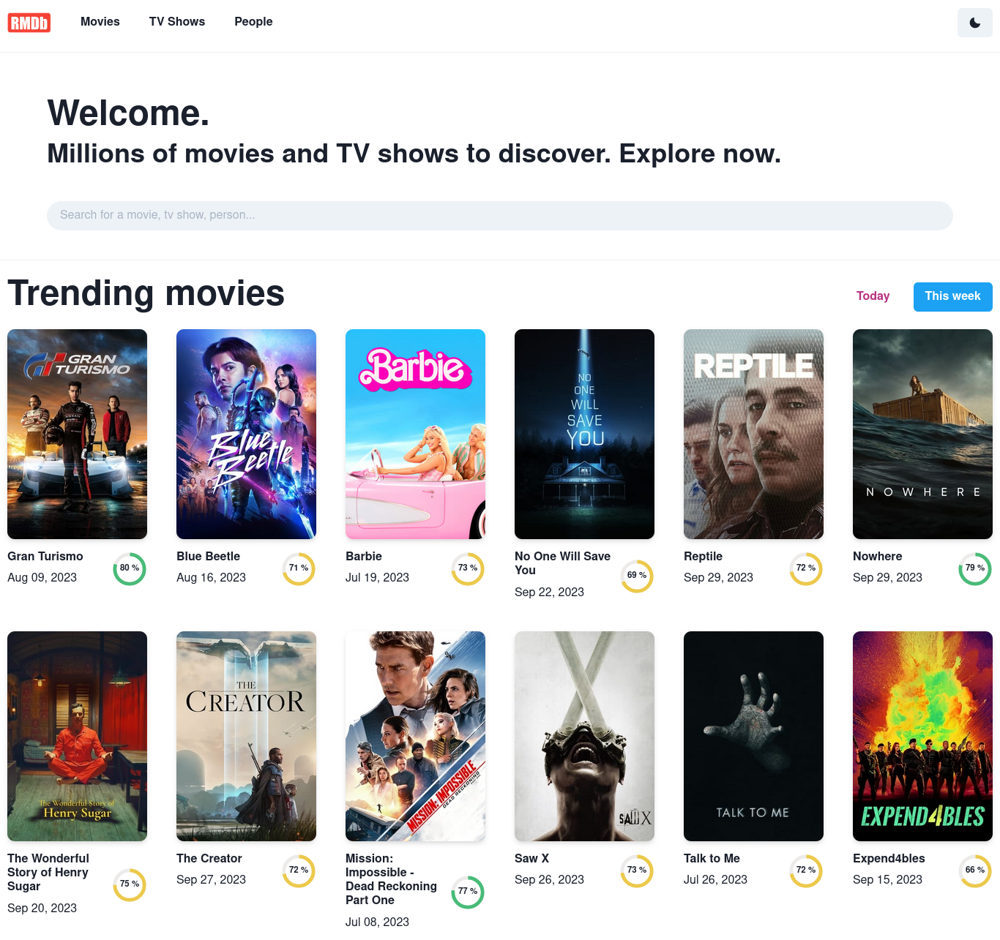

# Movie Search App

Welcome to the Movie Search App! This application is built using React with Vite.js, TypeScript, Chakra UI, React Query, Zustand, and React Router. It allows users to search for movies, tv shows, actors, directors, collections, keywords and companies based on the TMDB API and explore details about each title. The app is deployed on Vercel.





## Live Demo

Check out the live demo of the Movie Search App: [Movie Search App Demo](https://movie-search-app-radouaneoubakhanes-projects.vercel.app/)


## Features

- **Search Movies, TV Shows, People, Collections, Keywords and Companies**: Users can search for movies, tv shows, actors, directors, collections, keywords and companies by entering keywords.
- **View Details**: Detailed information about movies, tv shows and people, including synopsis, release date, cast, and more.
- **Filter and Sort Options**: Users can filter movies and tv shows based on genres, release years, ratings, and more. They can also sort the results based on popularity, ratings, and release dates.
- **Custom Menu**: A custom menu for direct access to popular, top-rated, upcoming, now playing, and more. Users can easily navigate to specific categories without searching.
- **Responsive Design**: The app is designed to work seamlessly on various devices and screen sizes, ensuring a consistent user experience.

## Technologies Used

- **React**: A JavaScript library for building user interfaces.
- **Vite.js**: A fast build tool for modern web development.
- **TypeScript**: A statically typed superset of JavaScript that enhances the development experience.
- **Chakra UI**: A simple, modular, and accessible component library for React applications.
- **React Query**: A data-fetching and state management library for React applications.
- **React Router**: A declarative routing library for React applications.
- **Zustand**: A state management library for React applications, providing a simple and straightforward way to manage state without the need for complex abstractions.
- **TMDB API**: The app fetches real-time data from the [TMDB API](https://developer.themoviedb.org/reference/intro/getting-started).

## Getting Started

### Prerequisites

- **Node.js**: Make sure you have Node.js installed on your system. You can download it from [nodejs.org](https://nodejs.org/).

### Installation

1. **Clone the Repository**:

   ```bash
   git clone https://github.com/radouane-oubakhane/movie-search-app.git
   ```

2. **Change into the Project Directory**:
   ```bash
   cd movie-search-app
   ```

3. **Install Dependencies**:
   ```bash
   npm install
   # or
   yarn install
   ```

### Configuration
**TMDB API Key**: The app uses the [TMDB API](https://developer.themoviedb.org/reference/intro/getting-started) to fetch real-time data. You need to create an account on TMDB and generate an API key. Once you have the API key, create a `.env` file in the root directory of the project and add the following line to it:
   ```bash
   VITE_TMDB_API_KEY=your-api-key
   ```
   Replace `your-api-key` with your actual API key.

### Running the App
**Start the Development Server**:

   ```bash
   npm run dev
   # or
   yarn dev
   ```
   
this will start the development server on [http://localhost:5173](http://localhost:5173).

### Building the App
**Build the App**:

   ```bash
   npm run build
   # or
   yarn build
   ```

this will build the app for production to the `dist` folder.

## Contributing
Contributions are welcome! Feel free to open an issue or submit a pull request.

